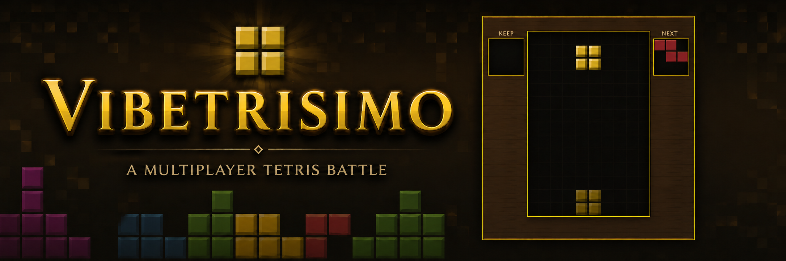

# VibeTrisimo

A browser-based multiplayer Tetris battle with a medieval stone-and-torch look. Host a room, share a 5-character code, and fight until one player remains.

**Play:** [tetris.toeffe.uk](https://tetris.toeffe.uk)

## Features

- **Peer-to-peer multiplayer** — host-relay lobby for up to **8** players (PeerJS / WebRTC)
- **Last survivor wins** — clear lines to send garbage; top out and you’re eliminated
- **Hold / next / ghost** — keep a piece (`C`), preview the next one, and see the drop ghost
- **7-bag randomizer** — fair piece distribution
- **Drop speed** — host picks Slow / Normal / Fast / Turbo before the match
- **Garbage targeting** — host picks who receives attacks (next in line, anyone, or left/right only)
- **Speed ramp** — optional host setting that levels up over time as well as by lines cleared
- **Clear / combo FX** — callouts plus optional confetti, glitter, embers, and fireworks (FX toggle next to the language buttons; preference is remembered)
- **Host succession** — if the host leaves in the lobby or rematch screen, the next player takes over and others reconnect
- **Rematch lobby** — everyone clicks Play again to start the next match
- **Touch pads** — on-screen controls for phones and tablets
- **English & Danish** — language toggle in the corner; preference is remembered

## How to play

1. Enter a name (max 12 characters, saved in the browser).
2. **Host game** to create a room, or **Join game** and enter a friend’s 5-character code (copyable from the lobby).
3. In the lobby, mark **Ready**. When everyone is ready, the match starts.
4. Clear lines to attack. Survive longer than everyone else.

Solo hosting (one ready player) is allowed if you just want a practice board. New joins are rejected once a match has started.

### Controls

| Action        | Keyboard     | Touch pad |
|---------------|--------------|-----------|
| Move left     | `A` / `←`    | ◀         |
| Move right    | `D` / `→`    | ▶         |
| Soft drop     | `S` / `↓`    | ▼         |
| Rotate        | `W` / `↑`    | ↻         |
| Hard drop     | `Space`      | ⬇         |
| Hold (Keep)   | `C`          | Keep      |

Held left/right and soft drop use DAS/ARR-style repeat (160 ms delay, then 50 ms / 40 ms) so movement feels responsive on keyboard. Rotation uses simple wall kicks (±1 / ±2 columns).

### Combat rules

| Lines cleared | Garbage sent |
|---------------|--------------|
| 1             | 0            |
| 2             | 1            |
| 3             | 2            |
| 4             | 4            |

Garbage targeting is chosen by the host:

| Mode | Who gets garbage |
|------|------------------|
| Always the next player | Next alive player in lobby order (wraps around) |
| Anyone still alive | Any other alive player at random |
| Only left or right | Random between the alive players on either side in the circle |

Incoming rows have one random gap. Combos are visual only (callouts / FX) and do not add extra garbage. Last player still alive wins; if everyone tops out together, it’s a draw. Boards also track a classic score for the HUD, but survival decides the winner.

### Leveling

The host sets **Drop speed** for base gravity:

| Preset | Base drop interval |
|--------|--------------------|
| Slow   | 1400 ms            |
| Normal | 1000 ms            |
| Fast   | 400 ms             |
| Turbo  | 160 ms             |

Level then rises from lines cleared (every 10 lines) and, if **Speed increases over time** is on, also every 30 seconds of play. Each level shortens the drop interval by 75 ms from that base, floored at 120 ms so the game stays playable at high levels.

## Tech stack

Static front end — no build step and no game server of your own:

| Piece | Role |
|-------|------|
| `index.html` / `styles.css` / `app.js` | UI, theme, game + lobby logic |
| `peerjs.min.js` | PeerJS client (WebRTC data channels) |
| PeerJS cloud + STUN/TURN | Signaling and NAT traversal |

One player **hosts**. Guests connect to the host; the host relays roster, start, garbage, and board snapshots. Match state is driven client-side on each machine; remote boards are mirrored from state sync packets. If the host disconnects during lobby or rematch, the first remaining player becomes the new relay host and others reconnect to that peer id.

## Project layout

```
tetris_game/
├── index.html              # Shell: menu, lobby, boards, touch pads
├── app.js                  # Tetris logic, lobby, PeerJS networking, i18n
├── styles.css              # Stone / parchment / torch theme
├── peerjs.min.js           # Vendored PeerJS
├── favicon.ico / .png      # Browser icons
├── CNAME                   # GitHub Pages custom domain
├── LICENSE                 # MIT
├── README.md
├── fonts/                  # Cinzel / Cinzel Decorative (woff2)
└── textures/               # SVG fills + banner
    ├── stone.svg
    ├── wood.svg
    ├── parchment.svg
    ├── noise.svg
    └── Vibetrisimobanner.png
```

## Run locally

Serve the repo root over HTTP (PeerJS needs a proper origin; `file://` is unreliable):

```bash
# Python
python -m http.server 8080

# Node
npx serve .
```

Open `http://localhost:8080`. For multiplayer on one machine.

Deploy by publishing this folder to any static host (e.g. GitHub Pages — this repo uses the domain in `CNAME`).

## Browser support

Modern Chromium, Firefox, and Safari with WebRTC. Mobile browsers work via the on-screen pads. A shared network path that allows WebRTC (and TURN when needed) is required for remote play.

## License

Released under the [MIT License](LICENSE). Copyright (c) 2026 toeffe.
